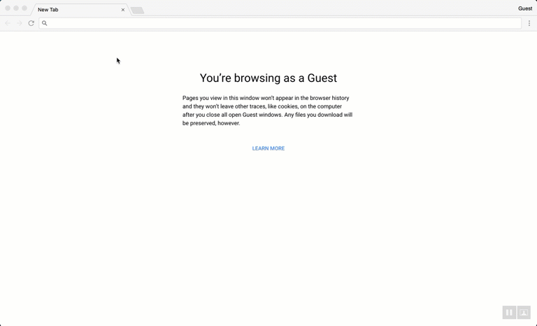

# Getting started building component libraries with the Angular CLI

One of the things that's always had a higher barrier of entry in the Angular ecosystem is creating libraries of components that other Angular apps can use. The Angular team published guidance with things like the [Angular Package Format](https://docs.google.com/document/d/1CZC2rcpxffTDfRDs6p1cfbmKNLA6x5O-NtkJglDaBVs/edit) and from that the community has created some fantastic tools, like [generator-angular2-library](https://github.com/jvandemo/generator-angular2-library), that make it easier. However, there was never a tool that generated opinionated implementations of the Angular Package Format the same way that developers who used the Angular CLI in their normal project workflows were used to.

With the recent release of version 6 for the Angular CLI, we now have access to tools that can help us build libraries while still taking advantage of other powerful aspects of the CLI, such as schematics, without leaving the workflows we are used to! Let's talk about how you can use the CLI to get started building your own component libraries.

We'll cover:

* [Generating a library with the Angular CLI](#generating-a-library-project-with-the-angular-cli)
* [Building components for your library](#building-components-for-your-library)
* [Using your library in other applications](#using-your-library-in-other-applications)
* [Publishing your library for others to use](#publishing-your-library-for-others-to-use)

## Generating a library project with the Angular CLI

First thing's first. Let's setup our project. If you don't have the latest version of the CLI let's grab it from npm.

```bash
$ npm install -g @angular/cli@latest
```

Now let's create a new project with the CLI. Nothing new here.

```bash
$ ng new my-app
```

If you're used to working with the Angular CLI you might notice a couple changes to the project structure you know and love. The most noticable of which is that the old `angular-cli.json` is gone and now replace with a new `angular.json` file. This file is the key to one of the biggest new features in version 6. Now the Angular CLI can create and work with workspaces that contain one or more multiple Angular apps. This `angular.json` file gives you control over the configuration of each of those projects. This is ultimately what makes building of libraries within the CLI possible because we need handle the building of libraries differently than we normally would for normal Angular apps.

Ok - so now we know a bit more about how libraries within CLI pojects work; let's generate the library structure in our project. We do this with the `generate` command just like we would to create a component, service, module, etc...

```bash
$ ng generate library my-new-lib
```

This creates a new `/projects` directory with a new folder for your library. We some example files, and some newer files.


The files to really take note of here are `/src/public_api.ts`, `ng-package.json`, and `ng-package.prod.json`. These files control the configuration for [ng-packagr](https://github.com/dherges/ng-packagr) - the library that powers the packaging of your library. I encourage you to check out the project and familiarize yourself with how it works, but here is a quick and dirty overview:

* `public_api.ts` is the new entry point for your library. If you have any files that you want accessable to consumers of your library (modules, components, etc...) you need to export them here in addition to exporting them from whatever modules are in your library.

```typescript
/* src/public_api.ts */

export * from './lib/my-new-library.service';
export * from './lib/my-new-library.component';
export * from './lib/my-new-library.module';
```

* `ng-package.json` and `ng-package.prod.json` control the configuration for the packaging process that ng-packagr performs. You can use them to change things like the destination build directory or defining a different entry point for your app. `ng-package.json` is used during your `ng build` command and `ng-package.prod.json` is used when you run `ng build --prod`. The only difference between these two files right now is that `ng-package.json` contains a `deleteDestPath` flag that will delete your destination directory before running a build. This will be helpful during development when you are constantly making changes.

> Protip: if your library needs to do something like bundle an overall Sass file, you will need to include something like [scss-bundle](https://github.com/SimplrJS/scss-bundle) in your workflow. [See here for more information](https://github.com/dherges/ng-packagr/issues/273#issuecomment-345059670)

## Building components for your library

Now that we have the general structure for our library setup, let's start building!

First let's add [Angular Material](https://material.angular.io) to our project.

```bash
$ ng add @angular/material --project my-app
```

"Wait, why are we adding Material to my-app and not my-new-lib?" Good question. The easy answer to that question is that the `ng add` command for Material only works for standard project configuration, those generated by the `ng new` command. If you were to run `ng add @angular/material --project my-new-lib` you would get an error saying so. The schematic that is being run in the background to add Material assumes you are adding it to an existing Angular app and not a library so it won't understand since the structure inside `angular.json` that is setup for your library.

This allows you to build and maintain libraries that are utilized by your project without needing to publish them to the registry while avoiding having to figure out which dependencies go where. Instead, you'll simply run `npm install` at the root of your application and get all the depencies for both your application and libraries. This will be helpful for when we create the demo of our library within this same project.

For libraries that will be installed and consumed by third parties (hint, hint: ours) you'll need to add things like Material to the peer depencies. There's a good discussion about when to use peer vs. normal depencies [here](https://stackoverflow.com/questions/26737819/why-use-peer-dependencies-in-npm-for-plugins). Let's go ahead and add to our peer dependencies now.

```json
{
  "name": "my-new-library",
  "version": "0.0.1",
  "peerDependencies": {
    "@angular/common": "^6.0.0-rc.0 || ^6.0.0",
    "@angular/core": "^6.0.0-rc.0 || ^6.0.0",
    "@angular/cdk": "^6.1.0",
    "@angular/material": "^6.1.0"
  }
}
```

Let's setup the module for our library. First, delete the example files that were generated by the CLI in src/lib.

```bash
$ cd projects/my-new-library/src/lib
$ ng generate module my-lib-module --flat --spec false
```

Since we will want others to consume this module we need to add it to `public_api.ts`.

```typescript
/*
 * Public API Surface of my-new-library
 */

export * from './lib/my-lib.module';
```

Let's have our library have a component that is a button that will count and display the number of times it's been clicked. Each time it is clicked it should also emit an event to let any parent component know that the count has changed and what the current count is.

First let's generate our component.

```bash
$ ng generate component counter-button
```

Let's export it from our library. Also import the `MatBadgeModule` and `MatButtonModule` while we are here.

```typescript
import { NgModule } from '@angular/core';
import { CommonModule } from '@angular/common';
import { MatButtonModule } from '@angular/material/button';
import { MatBadgeModule } from '@angular/material/badge';

import { CounterButtonComponent } from './counter-button/counter-button.component';

@NgModule({
  imports: [CommonModule, MatBadgeModule, MatButtonModule],
  declarations: [CounterButtonComponent],
  exports: [CounterButtonComponent]
})
export class MyLibModule {}
```

Also add the component to `public_api.ts`

```typescript
import { Component, OnInit, EventEmitter } from '@angular/core';

@Component({
  selector: 'lib-counter-button',
  templateUrl: './counter-button.component.html',
  styleUrls: ['./counter-button.component.css']
})
export class CounterButtonComponent implements OnInit {
  countChanged = new EventEmitter<number>();
  clickCount = 0;
  visible = false;

  constructor() {}

  ngOnInit() {}

  /**
   * Increments the count when the button is clicked and emits an event
   * to notify parent compont of new count value
   */
  handleButtonClick() {
    this.clickCount++;
    this.visible = this.visible ? this.visible : true;
    this.countChanged.emit(this.clickCount);
  }
}
```

Next we'll wire up the component to the template.

```html
<button type="button" mat-raised-button color="primary" [matBadge]="clickCount" matBadgeColor="accent" [matBadgeHidden]="!visible"
  (click)="handleButtonClick()">Click Me!</button>
```

Now we have a component that we want other apps to use! But how do we make sure it works? We'll handle that next.

## Using your library in other applications

Alright, we have an awesome library ready for use - but how do we actually use it? There's a couple of different ways.

The first is to use it within the application that was generated by the CLI when we first started our work. Remember, the Angular CLI doesn't just generate a single app anymore; instead it generates what the CLI team refers to as a workspace. This means you can build multiple apps and libraries in the same directory and utilize what you built within other projects in the same workspace.

Open up `tsconfig.json` in the root of your workspace. You'll see a `paths` option that points to a `dist/my-new-library` directory.

```json
{
  "compilerOptions": {
    ...
    "paths": {
      "my-new-library": ["dist/my-new-library"]
    }
  }
}
```

What this does is allow you to automatically use your library, after it's been built, in other apps in the workspace. This works similarly to how using libraries installed by npm in that you can just import your components and use in your library. This of course means that you _must_ build any libraries that your app depends on **before** you build your app, and will need to rebuild it every time you make a change to the library before those changes will be reflected.

A sample workflow could work like this:

```bash
$ ng build <library-name> // builds your library
$ ng build <app-name> // builds the application that depends on your library
```

Let's go ahead and build our library and build an example of how to use it using the app generated in our workspace.

```bash
$ ng build my-new-library
```

This generates the `dist/` directory mentioned eariler. If you open that directory and take a look you'll see that ng-packagr has generated FESM2015, FESM5, and UMD bundles of the library for consumption and generated a types file.


Now we are ready to use the library our app!

Import our module in `src/app/app.module.ts`

```typescript
import { BrowserModule } from '@angular/platform-browser';
import { BrowserAnimationsModule } from '@angular/platform-browser/animations';
import { NgModule } from '@angular/core';

import { AppComponent } from './app.component';
import { MyLibModule } from 'my-new-library';

@NgModule({
  declarations: [AppComponent],
  imports: [BrowserModule, BrowserAnimationsModule, MyLibModule],
  providers: [],
  bootstrap: [AppComponent]
})
export class AppModule {}
```

Now let's add the `CounterButtonComponent` to `src/app/app.component.html`

```html
<div style="text-align:center; padding: 20px;">
  <lib-counter-button></lib-counter-button>
</div>
```

Let's our example app in action!

```bash
$ ng build my-new-library // build your library
$ ng serve // serve the Angular app dependent on your library
```

Open the browser and you'll see your component in action!



Using libraries like this is a great way for you to share code between multiple Angular apps in the same workspace. Additionally, if you are building something like a component library that you could use the originally generated Angular app to build great working examples for your library.

## Publishing your library for others to use

So, you've built an awesome component library and are using it in your own applications, but what if you want to share it so others can use it in their apps?

First, if you haven't published anything on npm before go ahead and sign up.

```bash
$ npm adduser
```

After you sign into your npm account, build the library again. This time use the `--prod` flag so that the Angular CLI will perform some additional steps for optimization.

```bash
$ ng build my-new-library --prod
```

Now move into `dist/my-new-library`. If you want to test that your package will work in other apps you can link it to your local npm registry.

```bash
$ npm link
```

Now create a new Angular workspace and link your library to the project.

```bash
$ cd ~/Desktop
$ ng new test-lib-app
$ cd test-lib-app
$ npm link my-new-library
```

Also add `preserveSymLinks` to `angular.json` in the `options` object under `projects/test-lib-app/architect/build`. This allows the linking of your library to continue working when the app is served.

```json
"architect": {
  "build": {
    "builder": "@angular-devkit/build-angular:browser",
    "options": {
      "preserveSymlinks": true,
      "outputPath": "dist/test-lib-app",
      "index": "src/index.html",
      "main": "src/main.ts",
      "polyfills": "src/polyfills.ts",
      "tsConfig": "src/tsconfig.app.json",
      "assets": ["src/favicon.ico", "src/assets"],
      "styles": ["src/styles.css"],
      "scripts": []
    }
  }
}
```

Use the library in the same way we did eariler and you see that it will work here as well! To remove the linked library you can use an `npm remove my-new-library` command in the test project and the `npm unlink` command in the directory of your built library.

If you are ready to publish your app to npm for others go ahead and run the below command inside of your `dist/my-new-library` directory.

```bash
$ npm publish
```

Congratulations! You have built your component library with Angular and have published it to npm for others to use. Go forth and build cool libraries to share!

You can find the code used in the examples in Github [here](https://github.com/bniedermeyer/component-libraries-with-angular-cli). For next steps I also highly encourage you to dive into the documentation for [ng-packagr](https://github.com/dherges/ng-packagr/issues?q=label%3Adocumentation%20) to learn about more advanced topics about the library packaging process.
